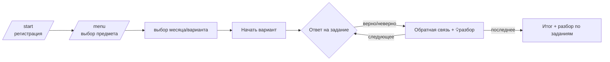

# 🎓 ОГЭ-Тренажёр — Telegram-бот для первой части ОГЭ

> Open-source Telegram bot for practising Part 1 (short-answer) of the Russian OGE exam.
> Built with **aiogram 3**, **async SQLAlchemy 2** and an extensible YAML task bank.

[](https://github.com/vladimirtrushin/OGE_Telegram_Bot/actions/workflows/ci.yml)
[](https://www.python.org/)
[](https://github.com/astral-sh/ruff)
[](LICENSE)

Ученик логинится, выбирает **предмет** и **вариант месяца** и решает первую
(тестовую) часть экзамена. Ответы проверяются автоматически, в конце — результат
и разбор. Задания хранятся в обычных YAML-файлах, поэтому материалы легко
расширять без единой строчки кода.

---

## ✨ Возможности

- 🔐 **Простая регистрация** («логин») — имя и класс.
- 📚 **Каталог**: предмет → месяц (вариант) → задания.
- ✅ **Автопроверка** ответов: числа (`0.4` == `0,4`), последовательности
  (`2 3 1` == `231`), текст (регистр и `ё`/`е` не важны).
- 🖼 **Поддержка изображений** к заданиям — по ссылке на хранилище (`image_url`)
  или по кэшированному Telegram `file_id`.
- 📊 **Результаты и разбор** после каждого варианта, профиль с историей.
- 🧩 **Расширяемые материалы** — добавляйте варианты в `data/`, применяйте `/reload`.
- 🗄 **SQLite из коробки**, переключение на **PostgreSQL** одной переменной.
- 🐳 **Docker Compose**, ♻️ **Alembic**, ✔️ тесты, 🧹 ruff, 🤖 CI — «взрослая» обвязка.

## 🧱 Архитектура

Слоистая структура — правило хорошего тона для ботов на aiogram 3 в 2026 году:
хендлеры не знают про SQL, бизнес-логика изолирована и тестируется без Telegram.

```
Telegram ⇄ aiogram Dispatcher
                │  middlewares: DbSession → User
                ▼
            handlers/         ← только приём апдейтов и ответы
                │  (keyboards, states, texts)
                ▼
            services/         ← бизнес-логика (exam, grading, loader)
                │
                ▼
            repositories/     ← все запросы к БД
                │
                ▼
            db/models         ← async SQLAlchemy 2.0 ORM
                │
                ▼
        SQLite  /  PostgreSQL
```

Поток решения варианта:



## 🚀 Быстрый старт (SQLite, без Docker)

```bash
git clone https://github.com/vladimirtrushin/OGE_Telegram_Bot.git
cd OGE_Telegram_Bot

python -m venv .venv && source .venv/bin/activate   # Windows: .venv\Scripts\activate
pip install -e ".[dev]"

cp .env.example .env            # впишите BOT_TOKEN от @BotFather
python scripts/seed.py          # загрузит примеры вариантов в ogebot.db
python -m ogebot                # запуск бота (long polling)
```

Откройте бота в Telegram, нажмите **/start** и решайте 🎉

## 🐳 Быстрый старт (Docker: бот + PostgreSQL + Redis)

```bash
cp .env.example .env            # впишите BOT_TOKEN
docker compose up --build
```

Compose поднимет PostgreSQL и Redis, накатит схему, засеет данные и запустит бота.

## ➕ Как добавить свои материалы

Создайте файл `data/variants/<предмет>/<месяц>.yaml`:

```yaml
subject: informatics
subject_title: Информатика
slug: "2026-11"
month: Ноябрь 2026
title: Информатика ОГЭ — ноябрь 2026
tasks:
  - number: 1
    statement: "Условие задания…"
    answer_type: number        # number | text | sequence
    answer: 42                  # значение или список принимаемых ответов
    image_url: null            # необязательно: ссылка на картинку
    explanation: "Разбор…"     # необязательно
```

Затем `python scripts/seed.py` (или `/reload` в чате, если вы админ).
Полное описание формата — в [`data/README.md`](data/README.md).

> 🧪 Есть свой источник заданий? Загляните в
> [`scripts/parse_fipi.py`](scripts/parse_fipi.py) — это каркас парсера
> (fetch → extract → YAML). Проверяйте условия использования источника.

## ⚙️ Конфигурация

Все настройки — через переменные окружения / `.env` (см. [`.env.example`](.env.example)).

| Переменная            | По умолчанию                       | Назначение                                   |
|-----------------------|------------------------------------|----------------------------------------------|
| `BOT_TOKEN`           | —                                  | Токен бота от @BotFather (обязательно)       |
| `DATABASE_URL`        | `sqlite+aiosqlite:///./ogebot.db`  | Async-URL базы. Postgres: `postgresql+asyncpg://…` |
| `REDIS_URL`           | пусто                              | Хранилище FSM (иначе — в памяти)             |
| `ADMIN_IDS`           | пусто                              | ID админов через запятую (`/reload`, `/stats`) |
| `IMMEDIATE_FEEDBACK`  | `true`                             | Показывать верность сразу или только в конце  |
| `DATA_DIR`            | `data`                             | Папка с YAML-вариантами                       |
| `INIT_DB_ON_STARTUP`  | `true`                             | Создавать таблицы при старте (для SQLite)     |

## 🗄 Миграции (PostgreSQL / продакшн)

Для SQLite-разработки таблицы создаются автоматически. Для продакшна:

```bash
export INIT_DB_ON_STARTUP=false
alembic revision --autogenerate -m "initial schema"   # один раз
alembic upgrade head
```

## 🧪 Разработка

```bash
make dev      # установка dev-зависимостей + pre-commit
make test     # pytest
make lint     # ruff check
make fmt      # автоформат
make run      # запуск бота
```

Ядро проверки ответов ([`services/grading.py`](src/ogebot/services/grading.py))
не зависит от Telegram и БД — его легко покрывать тестами.

## 📁 Структура проекта

```
ogebot/
├── data/variants/         # 📚 банк заданий (YAML) — расширяемые материалы
├── scripts/               # seed.py (загрузка данных), parse_fipi.py (парсер-каркас)
├── migrations/            # Alembic
├── src/ogebot/
│   ├── bot.py             # сборка Dispatcher, middlewares, запуск polling
│   ├── config.py          # настройки (pydantic-settings)
│   ├── db/                # base, engine, models
│   ├── repositories/      # доступ к данным
│   ├── services/          # grading, loader, exam
│   ├── handlers/          # start, catalog, exam, admin, common
│   ├── keyboards.py       # инлайн-клавиатуры + callback data
│   ├── states.py          # FSM-состояния
│   └── texts.py           # весь текст интерфейса (готово к i18n)
└── tests/                 # grading (unit), loader и exam-flow (integration)
```

## 🛠 Технологии

**aiogram 3** · **SQLAlchemy 2.0 (async)** · **Alembic** · **Pydantic v2** ·
**SQLite / PostgreSQL** · **Redis** (опц.) · **structlog** · **pytest** ·
**ruff** · **Docker**.

## 🗺 Идеи для развития (good first issues)

- [ ] Вторая часть экзамена (задания с развёрнутым ответом, ручная проверка).
- [ ] Таймер варианта и режим «как на экзамене».
- [ ] Веб-панель для загрузки/редактирования вариантов.
- [ ] Лидерборд и статистика по классам.
- [ ] Локализация (`texts.py` уже вынесен отдельно).

## 🤝 Вклад

PR и issue приветствуются! См. [CONTRIBUTING.md](CONTRIBUTING.md).

## 👨‍🏫 Автор

**Трушин Владимир Васильевич**

Есть вопрос по заданию или хочешь позаниматься? Пиши в Telegram:
[@Vladimir_Trushin](https://t.me/Vladimir_Trushin)

## 📄 Лицензия

[MIT](LICENSE). Учебные задания в `data/` — оригинальные примеры для демонстрации формата.
